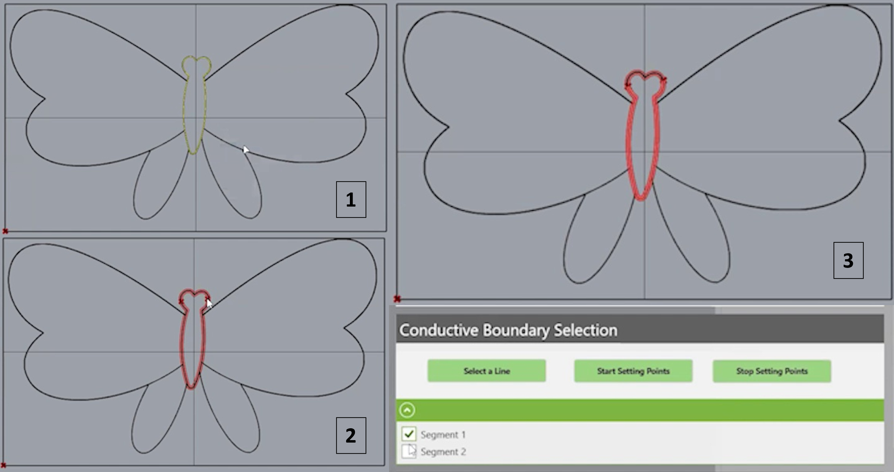

# Welcome to IrOnTex Design Tool! 🌟

Hey there! We’re thrilled you’re here. This guide is here to help you navigate and make the most of the IrOnTex Design Tool.

More information of the tool can be found in our paper. If you use this work, please cite our paper:

```

Jiakun Yu, Supun Kuruppu, Biyon Fernando, Praneeth Bimsara Perera, Yuta Sugiura, Sriram Subramanian, Anusha Withana. 2024. IrOnTex: Using Ironable 3D Printed Objects to Fabricate and Prototype Customizable Interactive Textiles. The Proceedings of the ACM on Interactive, Mobile, Wearable and Ubiquitous Technologies (IMWUT). DOI: https://doi.org/10.1145/3678543

```

## 🚀 Getting Started

### Preinstallation

Before using our design tool, you need to set up a couple of prerequisites. 

Our tool runs as a Grasshopper extension on Rhino. We used [Rhino Version 7 SR36](https://www.rhino3d.com/download/archive/rhino/7/latest/) which can be downloaded and installed from the official website.

### Main Grasshopper File
Download the contents of this repository and find the main Grasshopper file in the `GH` folder. To get started, double-click `ToolKit_with_patterning.gh` file, it should automatically open with the Grasshopper.

<!-- After installing Rhino, open it and launch Grasshopper by clicking the Grasshopper button inside Rhino. -->
The first time you run the Grasshopper file, it will prompt you to install several plugins essential for our design tool: [Human UI](https://www.food4rhino.com/en/app/human-ui), [Bitmap+](https://www.food4rhino.com/en/app/bitmap), [MetaHopper](https://www.food4rhino.com/en/app/metahopper), [Pufferfish](https://www.food4rhino.com/en/app/pufferfish) and [LunchBox](https://www.food4rhino.com/en/app/lunchbox). You should follow the provided instructions to install the missing plugins.

If you encounter any issues while installing the plugins, you can manually install them by refering to this [YouTube video tutorial](https://www.youtube.com/watch?v=poE07hYaQ9o&t=110s) for detailed guidance on how to install Grasshopper plugins.

Once all installations are complete, you're ready to use our design tool!


### Main Menu of the Design Tool
<p align="center">
  
</p>

## Steps for IrOnTex design
There are 7 main steps that a user should follow to make a design with this design tool. They are,
1. Selecting the reference image for the design
2. Generating surfaces from the reference image
3. Tuning Young's Modulus of the designs
4. Assigning filaments to each surface
5. Integrating stretch sensors into the design *(optional)*
6. Converting image boundaries to conductive boundaries in the design *(optional)*
7. Exporting the design for 3D printing

The above-mentioned steps 4 and 5 are optional and should only be done when stretch sensors and conductive boundaries are needed in the design respectively.

The sub-steps for each above-mentioned main step are described below.

### 1. Selecting the reference image for the design
This step involves importing the reference image for the design. The controls for this step are in the **Image Selection and Preview** tab.

1. Click the **File Select** button and select the image from the pop-up window.
2. Use the **Preview Image** toggle switch to toggle the preview of the image between on and off. 

<p align="center">
  
</p>

3. Adjust the **Threshold** slider to fine-tune the segmentation output.
4. Adjust the **Scale Factor** slider to control the scale of the generated surfaces in the Rhino environment.


### 2. Generating surfaces from the reference image
This step involves creating foundational surfaces based on the reference image, which will serve as the basis for the entire design. The controls for this step are in the **Image Selection and Preview** tab.

1. Click the **Create Surfaces** button to generate surfaces corresponding to color segments of the reference image.

<p align="center">
  
</p>


### 3. Tuning Young's Modulus of the design
This step is done to adjust the Young's Modulus of the final hex patterned design. The controls for this step are in the **Tune Young's Modulus (E) of the Design** tab.

1. Change the **Distance(D)** slider to adjust the distance between hexagons in the hex-patterned design.
2. Change the **Radius(R)** slider to adjust the radius of hexagons in the hex patterned design.
3. Adjust the above sliders until the desired Young's Modulus value is displayed at **E**.

<p align="center">
  
  
</p>


### 4. Assigning filaments to each surface

When it comes to utilizing multiple filaments in your design it is necessary to assign different filaments to different surfaces and generate STL files separately accordingly. Follow these steps to do it.

Note: the 'filements.txt' inside the 'Flow' folder contains meta information of all the filaments. Changing the hierarchy and the content of this file is not suggested.

1. First click the Select **Surfaces button**
2. Then select the surfaces in the Rhino environment.
3. By selecting filament from the ribbon buttons, you can assign filaments.
4. You can add or remove elements from the filament list using the **Edit Filament List** button
5. Then you can reset the selection from the **Reset** button

<p align="center">
  
   
</p>


### 5. Integrating stretch sensors into the design
This step needs to be done if the user requires a stretch sensor in his/her design. The controls for this step are in the **Stretch Sensor Integration** tab.

1. Click the **Select the Sensor Surfaces** button.
2. Select the surfaces that the stretch sensor should span in the Rhino user interface and press **Enter**.
3. Click **Draw the Direction Line** button.
4. Draw a line through the selected surfaces, denoting the stretch direction that needs to be sensed.
5. Click **Select the Direction** button.
6. Select the line drawn in step 4 and press **Enter**.

<p align="center">
  
</p>

### 6. Converting image boundaries to conductive boundaries in the design
This step is done to convert boundaries in the reference image to conductive lines. It is a useful feature when incorporating electronic components into the design. The controls for this step is in the **Conductive Boundary Selection** tab.

1. Click the **Select a Line** button.
2. Select a boundary in the surfaces generated from the image and press **Enter**.
3. Click the **Start Setting Points** button.
4. Set pairs of points to split the boundary at desired places. A point can be placed by clicking the **middle mouse button** at the desired location.
4. Click the **Stop Setting Points** button to obtain a list of segmented conductive boundaries.
5. Select the segments that need to be included in the design from the list and press **Enter**.

<p align="center">
  
</p>

### 7. Exporting the design for 3D printing
This step is done to generate the .STL files for the specified design for 3D printing purposes. The controls for this step are in the **Export Parts** tab.

1. Click the **Generate STL** button.
2. Navigate to the **outputs** folder of your project directory to access the generated .STL files.


🎉 **Happy Designing!**

Feel stuck? Got questions or bump into any issues? Don’t hesitate to shout – we’re here to help!


## Contributors (From aid-lab)

- [@JiakunYu](https://www.github.com/JiakunYu)
- [@PraneethPerera99](https://www.github.com/PraneethPerera99)
- [@SupunDK](https://www.github.com/SupunDK)
- Biyon Fernando
- [@wdanusha](https://www.github.com/wdanusha)


## License

This work is licensed under a [Creative Commons Attribution 4.0 International License](https://creativecommons.org/licenses/by/4.0/).

<p align="left">
  
</p>

